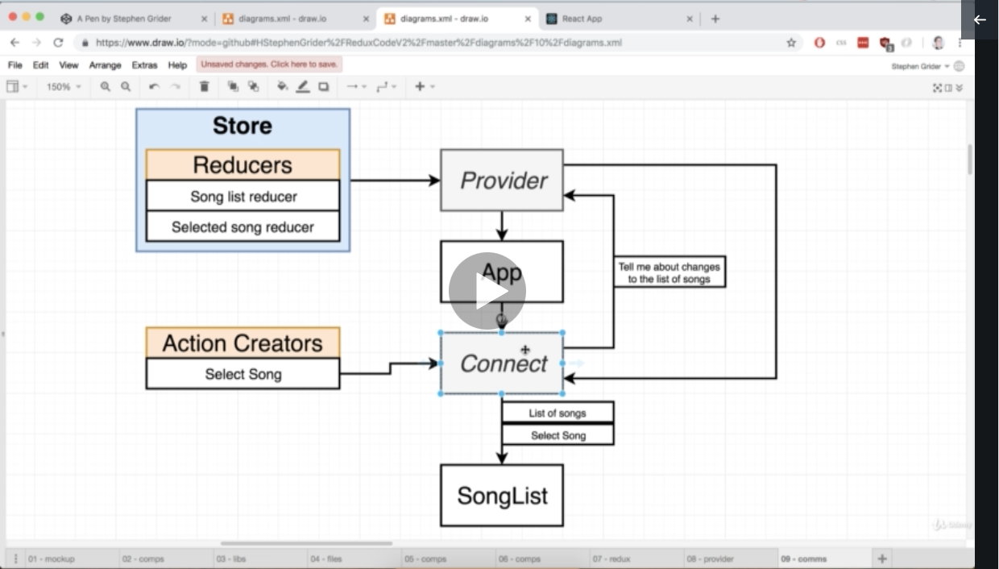
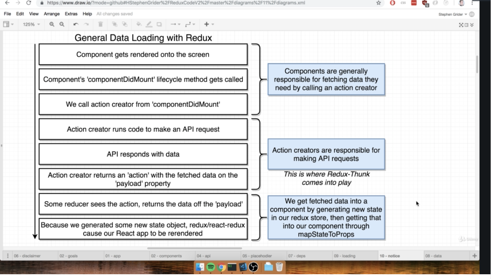
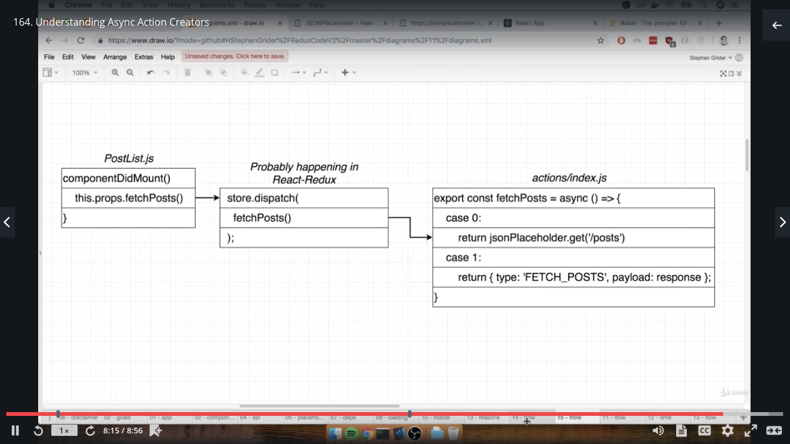
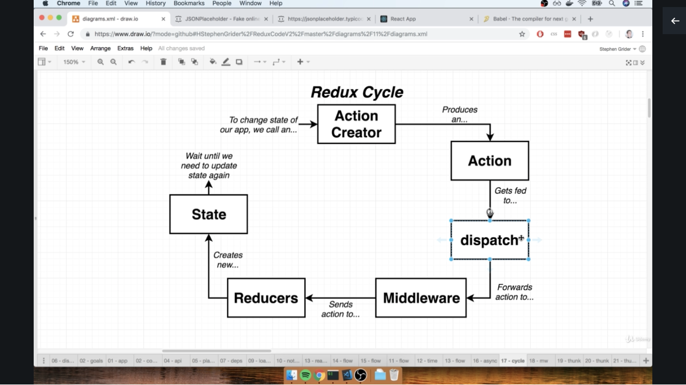
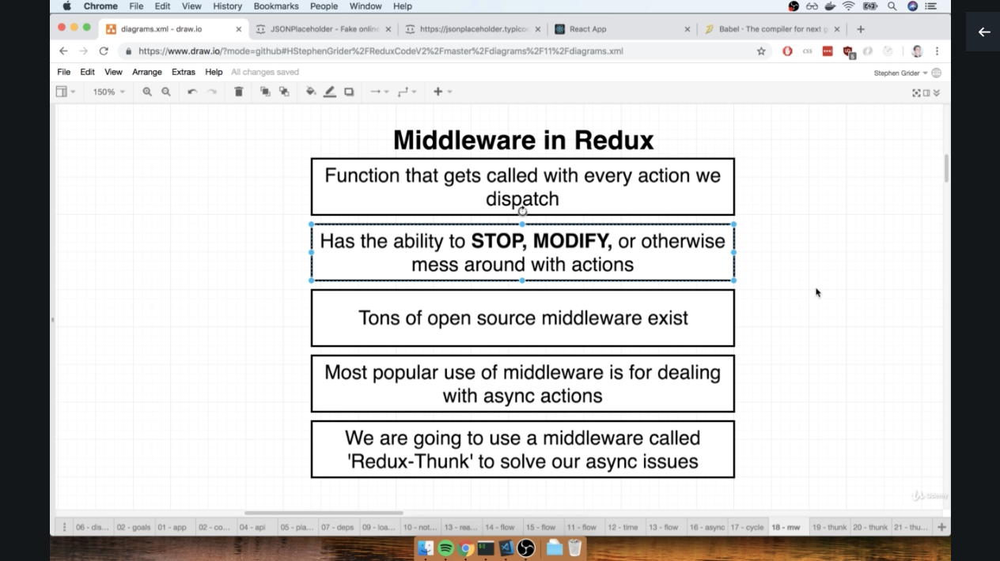
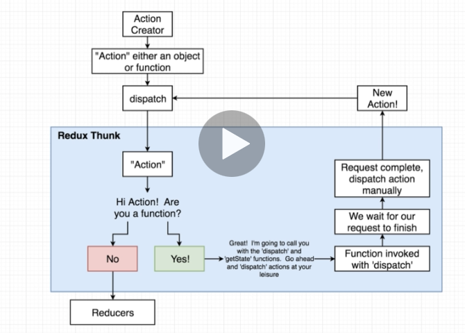
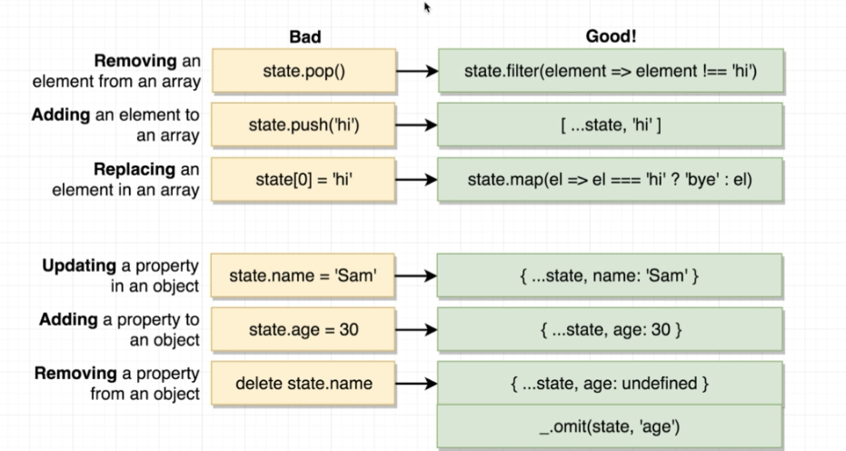

# A typical callback function (get geolocation):

```js
const App = () => {
    // The function `getCurrentPosition`: https://developer.mozilla.org/en-US/docs/Web/API/Geolocation/getCurrentPosition
    // a successfull call stores the geolocation within `position`. error stores within `err`
    // NOTE: we're actually PASSING a callback function into `getCurrentPosition`. `getCurrentPosition` doesn't store
    // the result on its own
    window.navigator.geolocation.getCurrentPosition(
        position => console.log(position),
        err => console.log(err)
    );

    return <div>Hi There!</div>;
};
```

# Classes and State

-   State can only be used with class components (mostly)
-   State is NOT the same as props
-   The key to re-render a component; we must update its state
-   State must be initialised when a component is created
-   State can **only** be updated using the function `setState`, e.g:
    `this.setState({ lat: position.coords.latitute })`

    -   The ONLY time `state` can be directly references is during initialisation:
        `this.state = { lat: null }`

```js
import React from "react";
import ReactDOM from "react-dom";

class App extends React.Component {
    constructor(props) {
        super(props);

        this.state = { lat: null, lon: null };

        window.navigator.geolocation.getCurrentPosition(
            position => {
                this.setState({
                    lat: position.coords.latitude,
                    lon: position.coords.longitude
                });
            },
            err => console.log(err)
        );
    }

    render() {
        return (
            <div>
                Latitude: {this.state.lat}
                <br></br>
                Longitude: {this.state.lon}
            </div>
        );
    }
}

ReactDOM.render(<App />, document.querySelector("#root"));
```

# Component Lifecycle Methods:

-   Sequence:
    constructor -> render -> componentDidMount -> componentDidUpdate -> componentWillUnmount

-   constructor: called during component initialisation
    -> used for one-time setup stuff
    -> by convention, do any data-loading within componentDidMount and not here for centralised data-loading
-   render: called whenver state is updated (i.e. through `setState`)
    -> avoid doing anything besides returning JSX
-   componentDidMount: called immediately after content is visible on screen
    -> good place to do data loading
-   componentDidUpdate: waits to be called **after** and update (i.e. **after** render as been called)
    -> good place to do more data-loading when state/props change
-   componentWillUnmount: called when component is no longer shown
    -> good place to do cleanup (especially for non-React stuff)

# Event Handlers:

-   The following two provide the exact same functionality:

## SYNTAX 1:

```js
import React from "react";

class SearchBar extends React.Component {
    onInputChange(event) {
        console.log(event.target.value);
    }

    render() {
        return (
            <div className="ui segment">
                <form className="ui form">
                    <div className="field">
                        <label>Image Search</label>
                        <input type="text" onChange={this.onInputChange} />
                    </div>
                </form>
            </div>
        );
    }
}

export default SearchBar;
```

## SYNTAX 2:

```js
import React from "react";

class SearchBar extends React.Component {
    render() {
        return (
            <div className="ui segment">
                <form className="ui form">
                    <div className="field">
                        <label>Image Search</label>
                        <input type="text" onChange={event => console.log(event.target.value)} />
                    </div>
                </form>
            </div>
        );
    }
}

export default SearchBar;
```

## Controlled vs Uncontrolled Elements

-   A react app can be split into 'React' side and 'HTML' side
-   A user interacts with the HTML side, and react attempts to re-render etc.

-   controlled element: ensuring 'React' side knows about the data within HTML side, i.e. ensuring user-input is stored within **state**
-   uncontrolled element: data only exists within HTML DOM

## A Controlled element for user input, controlling user data through state:

```js
import React from "react";

class SearchBar extends React.Component {
    state = { term: "" };

    render() {
        return (
            <div className="ui segment">
                <form className="ui form">
                    <div className="field">
                        <label>Image Search</label>
                        <input
                            type="text"
                            // NOTE: we're setting 'input' element to the value it already is. Seems confusing but is just
                            // React convention
                            value={this.state.term}
                            onChange={e => this.setState({ term: e.target.value })}
                        />
                    </div>
                </form>
            </div>
        );
    }
}

export default SearchBar;
```

# Binding and 'this' keyword:

-   when using `this`, e.g. `this.state.myInput`, if this is not correctly binded to the class object, it would lead to 'TypeError: Cannot read property 'state' of undefined', since `this` may refer to `undefined`
-   There are a few methods to ensure we explicitly bind the element

## METHOD 1

```js
import React from "react";

class SearchBar extends React.Component {
    state = { term: "input something..." };

    // DOES THE BINDING
    constructor() {
        super();
        this.onFormSubmit = this.onFormSubmit.bind(this);
    }

    onFormSubmit(event) {
        event.preventDefault(); // Disables form's default auto-submit when enter is pressed
        console.log(this.state.term);
    }

    render() {
        return (
            <div className="ui segment">
                <form onSubmit={this.onFormSubmit} className="ui form">
                    <div className="field">
                        <label>Image Search</label>
                        <input
                            type="text"
                            value={this.state.term}
                            onChange={e => this.setState({ term: e.target.value })}
                        />
                    </div>
                </form>
            </div>
        );
    }
}

export default SearchBar;
```

## METHOD 2

```js
import React from "react";

class SearchBar extends React.Component {
    state = { term: "input something..." };

    // DOES THE BINDING
    onFormSubmit = event => {
        event.preventDefault(); // Disables form's default auto-submit when enter is pressed
        console.log(this.state.term);
    };

    render() {
        return (
            <div className="ui segment">
                <form onSubmit={this.onFormSubmit} className="ui form">
                    <div className="field">
                        <label>Image Search</label>
                        <input
                            type="text"
                            value={this.state.term}
                            onChange={e => this.setState({ term: e.target.value })}
                        />
                    </div>
                </form>
            </div>
        );
    }
}

export default SearchBar;
```

## METHOD 3

```js
import React from "react";

class SearchBar extends React.Component {
    state = { term: "input something..." };

    onFormSubmit(event) {
        event.preventDefault(); // Disables form's default auto-submit when enter is pressed
        console.log(this.state.term);
    }

    render() {
        return (
            <div className="ui segment">
                {/* DOES THE BINDING */}
                <form onSubmit={event => this.onFormSubmit(event)} className="ui form">
                    <div className="field">
                        <label>Image Search</label>
                        <input
                            type="text"
                            value={this.state.term}
                            onChange={e => this.setState({ term: e.target.value })}
                        />
                    </div>
                </form>
            </div>
        );
    }
}

export default SearchBar;
```

### BIND FIX EXAMPLE (with an async function):

```js
import React from "react";
import axios from "axios";
import SearchBar from "./SearchBar";

class App extends React.Component {
    state = { images: [] };

    onSearchSubmit = async term => {
        //  WAS PREVIOUSLY: `async onSearchSubmit(term) {`
        const response = await axios.get("https://api.unsplash.com/search/photos", {
            params: { query: term },
            headers: {
                Authorization: "Client-ID 8f963700517eb3bed42120eef3cb86dbe68052ea1f6cb81797e1a4761195e9cb"
            }
        });

        // Since onSearchSubmit is actually being called in another class (since it's passed as a prop within SearchBar),
        // `this` in `this.setState` refers to the SearchBar class. This line will therefore cause an error if not bound
        this.setState({ images: response.data.results });
    };

    render() {
        return (
            <div className="ui container" style={{ marginTop: "10px" }}>
                <SearchBar onSubmit={this.onSearchSubmit} />
                Found: {this.state.images.length} images
            </div>
        );
    }
}

export default App;
```

##### This binding issue can equally be solved using the legacy method (METHOD 1):

```js
import React from "react";
import axios from "axios";
import SearchBar from "./SearchBar";

class App extends React.Component {
    state = { images: [] };

    constructor() {
        super();
        this.onSearchSubmit = this.onSearchSubmit.bind(this);
    }

    async onSearchSubmit(term) {
        const response = await axios.get("https://api.unsplash.com/search/photos", {
            params: { query: term },
            headers: {
                Authorization: "Client-ID 8f963700517eb3bed42120eef3cb86dbe68052ea1f6cb81797e1a4761195e9cb"
            }
        });

        this.setState({ images: response.data.results });
    }

    render() {
        return (
            <div className="ui container" style={{ marginTop: "10px" }}>
                <SearchBar onSubmit={this.onSearchSubmit} />
                Found: {this.state.images.length} images
            </div>
        );
    }
}

export default App;
```

# API Calls

-   Can use `fetch` or `axios` to make calls, however `axios` is preferred

-   To install axios for a project: `npm install --save axios`

*   When a request is sent with Axios, it works asynchronously so the request can be generated in the background
    Once ready, axios returns a `promise` containing the response. There are 2 ways to get this `promise`:

## METHOD 1:

```js
import React from "react";
import axios from "axios";
import SearchBar from "./SearchBar";

class App extends React.Component {
    onSearchSubmit(term) {
        axios
            .get("https://api.unsplash.com/search/photos", {
                params: { query: term },
                headers: {
                    Authorization: "Client-ID 8f963700517eb3bed42120eef3cb86dbe68052ea1f6cb81797e1a4761195e9cb"
                }
            })
            .then(response => {
                console.log(response.data.results);
            });
    }

    render() {
        return (
            <div className="ui container" style={{ marginTop: "10px" }}>
                <SearchBar onSubmit={this.onSearchSubmit} />
            </div>
        );
    }
}

export default App;
import React from "react";
import axios from "axios";
import SearchBar from "./SearchBar";

class App extends React.Component {
    onSearchSubmit(term) {
        axios
            .get("https://api.unsplash.com/search/photos", {
                params: { query: term },
                headers: {
                    Authorization: "Client-ID 8f963700517eb3bed42120eef3cb86dbe68052ea1f6cb81797e1a4761195e9cb"
                }
            })
            .then(response => {
                console.log(response.data.results);
            });
    }

    render() {
        return (
            <div className="ui container" style={{ marginTop: "10px" }}>
                <SearchBar onSubmit={this.onSearchSubmit} />
            </div>
        );
    }
}

export default App;
```

## METHOD 2:

```js
import React from "react";
import axios from "axios";
import SearchBar from "./SearchBar";

class App extends React.Component {
    async onSearchSubmit(term) {
        const response = await axios.get("https://api.unsplash.com/search/photos", {
            params: { query: term },
            headers: {
                Authorization: "Client-ID 8f963700517eb3bed42120eef3cb86dbe68052ea1f6cb81797e1a4761195e9cb"
            }
        });

        console.log(response.data.results);
    }

    render() {
        return (
            <div className="ui container" style={{ marginTop: "10px" }}>
                <SearchBar onSubmit={this.onSearchSubmit} />
            </div>
        );
    }
}

export default App;
```

# MAP statements:

```js
const numbers = [0, 1, 2, 3, 4];
let newNumbers = [];

/* METHOD 1: for loops which is what maps do interanlly: */
for (let i = 0; i < numbers.length; i++) {
    newNumbers.push(numbers[i] * 10);
}

/* METHOD 2: long-form map function */
numbers.map(num => {
    return num * 10;
});

/* METHOD 3: short-hand map function */
numbers.map(num => num * 10);
```

# Keys for props in lists

-   React provides better performance if keys are attributed to elements in a list that would be rendered to the DOM.
-   e.g. rendering a List object containing 10  elements would perform better if each  was given a unique ID.
-   An ID only needs to be assigned to the **root** element of the list. e.g. if each element in the list was an  wrapped in a <div>, we'd only assign an ID to the <div> since it's the root of the element

-   e.g:

```js
const images = props.images.map(image => {
    return (
        <div key={image.id}>
            
        </div>
    );
});
```

# Destructuring JSON objects when using map:

```js
const images = props.images.map(image => {
    return ;
});
```

<!-- DESTRUCTURE `image` into only the properties we want to use -->

```js
const images = props.images.map(({ description, id, urls }) => {
    return ;
});
return <div>{images}</div>;
```

# React Ref system

-   React's 'Ref' system replaces Javascript's `document.queryselector`
-   It's a way to access the HTML DOM, but does it in a React-y way (doesn't actually access HTML DOM?)
-   E.g. creating a Ref for an image allows us to access the image's properties when it's rendered on the HTML DOM

```js
import React from "react";

class ImageCard extends React.Component {
    constructor(props) {
        super(props);
        this.imageRef = React.createRef();
    }

    componentDidMount() {
        console.log(this.imageRef);
    }

    render() {
        const { description, urls } = this.props.image;
        return (
            <div>
                
            </div>
        );
    }
}

export default ImageCard;
```

---

# REDUX

## Redux Cycle:

- Action Creator:
    - A function that creates or returns a plain JS object (i.e. its only purpose is to create the Action)

- Action:
    - The plain JS object
    - Has a `Type` and `Payload` property
    - describes some **change** we want to make to the data of our app

- dispatch:
    - takes an action, makes copies of it, then passes it to a number of places in the app

- Reducers:
    - Is a function which takes in an `Action` and the existing data
    - It looks at the Action's type to decide how it will update the existing data

- State:
    - is the central repository of information within the app


## Example Redux Application:

```js
// People dropping off a form (Action Creator)
const createPolicy = (name, amount) => {
  return { // Aaction (a form)
    type: "CREATE_POLICY",
    payload: {
      name: name,
      amount: amount
    }
  };
};

const deletePolicy = (name)  => {
  return {
    type: "DELETE_POLICY",
    payload: {
      name: name
    }
  };
};

const createClaim = (name, amountOfMoneyToCollect) => {
  return {
    type: "CREATE_CLAIM",
    payload: {
      name: name,
      amountOfMoneyToCollect: amountOfMoneyToCollect
    }
  };
};


// Reducers (Departments!)
const claimsHistory = (oldListOfClaims = [], action) => {
  if (action.type === "CREATE_CLAIM"){
    // SYNTAX NOTE: creates a NEW array containing `oldListOfClaims` and `action.payload`
    return [...oldListOfClaims,  action.payload];
  }
    return oldListOfClaims;
};

const accounting = (bagOfMoney = 100, action) => {
  if (action.type === "CREATE_CLAIM"){
    return bagOfMoney - action.payload.amountOfMoneyToCollect;
  }
  else if (action.type === "CREATE_POLICY"){
    return bagOfMoney + action.payload.amount;
  }
  return bagOfMoney;

};

const policies = (oldListOfPolicies = [], action) => {
  if (action.type === "CREATE_POLICY"){
    return [...oldListOfPolicies, action.payload.name];
  }
  else if (action.type === "DELETE_POLICY"){
    return oldListOfPolicies.filter(policy => policy !== action.payload.name);
  }
  return oldListOfPolicies;
} ;

const { createStore, combineReducers } = Redux;

const ourDepartments = combineReducers({
  accounting: accounting,
  claimsHistory: claimsHistory,
  policies: policies
});

const store = createStore(ourDepartments);

store.dispatch(createPolicy("Alex", 20));
store.dispatch(createPolicy("Jim", 30));
store.dispatch(createPolicy("Bob", 40));

store.dispatch(createClaim("Alex", 100));
store.dispatch(createClaim("Jim", 50));

store.dispatch(deletePolicy("Bob"))

console.log(store.getState());
```

## Imports and Named Exports
- usually a component can be exported from a file using `export default selectSong`
  these are then import using: `import selectSong from '../actions/SelectSong.js'`
- To export multiple components from the same file, we can used Named exports:
```js
export const selectSong = song => {
    return {
        type: "SONG_SELECTED",
        payload: song
    };
};
```
```js
import { selectSong } from  '../actions/SelectSong';
```

## Webpack and index.js
- Any file called `index.js` within a directory is automatically imported. e.g. the example above:

/src/actions/index.js
```js
export const selectSong = song => {
    return {
        type: "SONG_SELECTED",
        payload: song
    };
};
```
/src/index.js
```js
// selectSong is already imported and can be used
```

## Basic Redux App notes:


- SongList is connected  to the store through: SongList -> Connect ->  Provider -> Store
- Whenever the Store is updated, the Provider automatically notifies SongList


# Some Dependencies:
`npm install --save redux react-redux axios redux-thunk`

- redux: isn't React-specific
- react-redux: allows linking of React and Redux
- axios: an alternative to using `fetch` for network requsts, except is easier to use
- redux-thunk: middleware that allows making network requests directly from redux side of the app


# General flow of Data loading with Redux:


- Action Creators are used to initiate data loading

# Making requests directly from Redux and why Middleware is needed:

- usually we'd make a request using axios for api data-loading. When using Redux, we can use `componentDidMount` inside of a class-based component to call an Action Creator, which then calls the api for data-loading
- The Action Creator therefore looks something like this:

```js
export const fetchPosts = async () => {
    const response = await jsonPlaceholder.get("/posts");

    return {
        type: "FETCH_POSTS",
        payload: response
    };
};
```

However this WILL NOT WORK for 2 reasons:

1) Action creators must return plain JS objects with a typpe property, but fetchPosts is not:
- We're using `async`-`await` keywords to allow asynchronous data-loading, allow the response to be capture when it finally does come back
- however, ES2015 syntax converts this into syntax such as this:

```js
export const fetchPosts = async() => {
    case 0:
        return jsonPlaceholder.get("/posts")
    case 1:
        return {type: "FETCH_POSTS", payload: response };
}
```
- Initially `case 0` is returned, therefore returns the request itself. This is problematic since an Action Creator must be in JSON format and with a 'type' property. Redux therefore doesn't know how to resolve this and would flag an error.




2) By the time our action gets to a reducer, we won't have fetched our data:
- We remove the `async`-`await` syntax from above and instead return a `promise`
```js
export const fetchPosts = () => {
    const promise = jsonPlaceholder.get("/posts");
    return {
        type: "FETCH_POSTS",
        payload: promise
    };
};
```
- A promise will contain the response once it's ready
- However, by the time we get the response, our redux cycle has already progressed from:
  - Action Creator -> Action -> dispatch -> Reducer(Action)
- The Reducer therefore doesn't have an Action which holds any data, therefore no data is changed
- NOTE: WE DO NOT HAVE CONTROL OVER WHEN AN ACTION IS DISPATCHED. This is handled by Redux alone, therefore once an Action Creator is called, we just trust Redux does the state change to the Store


- Middleware is therefore required to resolve this.


# Middlewares:





- A Middleware is a plain JS function which is called with **every** action that's `dispatched`

# Redux Thunk
- Allows Action Creators to return:
    1) Action objects (as usual, i.e. does nothing if Action is just a normal Action object)
    2) Actions as functions:
        - Invokes function and calls it by passing `dispatch`  and `getState` functions
        - Redux Thunk, by using `dispatch`, therefore has unlimited power to change the Store
        - Through `getState` Thunk can read all data in the Store
- Redux Thunk allows MANUAL DISPATCH OF AN ACTION. We therefore have control over when an Action is dispatched to reducers



# Rules of Reducers:
- Must return any value besides 'undefined'
- Produces 'state' (data) to be used inside of your app using only previous state and the action
  - i.e. the initial state must not be null, as the Reducer will use that as a well as the Action being passed into it to then generate the state to be committed to the store
- Must not return reach 'out of itself / own function' to decide what value to return (reducers are pure)
  - i.e. all data generated by the reducer must be determinable by:
        1) previous state value
        2) Current Action passed in
- Must not return previous state.


# Some Javascript Stuff:
```js
// 1)
// Strings and numbers are immutable
const myString = "doughnut"
myString[0] = "K"
myString
> "doughnut"
// Therefore myString has not changed

// 2)
// '===' compares the memory location between objects and lists
const myList = [1,2,3]
myList === [1,2,3]
> false

```

# Updating State safely wihtin Reducers:


- This is all vanilla JS
- _.omit is from the `lodash` libray

# ownProps and Usability
- defining `ownProps` inside a `mapStateToProps` function is the same as using `this.props` inside the class
  it's bound to (note the `connect` function does this bining, e.g. `export default connect(mapStateToProps, { fetchUser })(UserHeader);`)

- People like to abstract all redux-related stuff to a different file to the class, therefore the class' usability is increased; can import the class without worrying about dragging the redux stuff along with it

# Memoize
- Lodash function `_memoize`: memorises the result of a request made with a given set of parameters. Any subsequent requests called with the same parameters would not actually initiate a request, but instead return the value retrieved previously.
- therefore `_memoize` allows to not make redundant requests when we know the result of the requests would be the same

```js
// given that getUser is a basic function which makes a network request
const memoizedGetUser = _.memoize(getUser)
memoizedGetUser(2) // makes request
memoizedGetUser(2) // does NOT make a request. Instead returns the original value returned the first time
memoizedGetUser(3) // makes a request since the parameter passed is different
```


# Converting an Arrow function to more simple syntax:

```js
export const fetchUser = id => async dispatch => {
    const response = await jsonPlaceholder.get(`/users/${id}`);

    dispatch({ type: "FETCH_USER", payload: response.data });
};

// ==>

export const fetchUser = function(id) {
    return async function(dispatch) {
        const response = await jsonPlaceholder.get(`/users/${id}`);

        dispatch({ type: "FETCH_USER", payload: response.data });
    };
};
```

---
# REACT ROUTER

## Basic React Router example:

```js
import React from "react";
import { BrowserRouter, Route } from "react-router-dom";

const PageOne = () => {
    return <div>PageOne</div>;
};

const PageTwo = () => {
    return <div>PageTwo</div>;
};
const App = () => {
    return (
        <div>
            <BrowserRouter>
                <div>
                    <Route path="/" exact component={PageOne} />
                    <Route path="/pagetwo" component={PageTwo} />
                </div>
            </BrowserRouter>
        </div>
    );
};

export default App;
```

## React Router Gotchas:
- multple components can be assigned to the same route (by design), e.g:
```js
<BrowserRouter>
    <div>
        <Route path="/" exact component={PageOne} />
        <Route path="/" exact component={PageTwo} />
    </div>
</BrowserRouter>
```

-  `exact` keyword requires the exact path defined (e.g. `/` not `/pageone`)
-  `Route path="/" exact component={PageOne} />` is the same as `Route path="/" exact={true} component={PageOne} />`

### Vanilla HTML <a/> tags should **NOT** be used with React Router

```js
const PageOne = () => {
    return (
        <div>
            PageOne BAD Routing!!
            <a href="/pagetwo">Navigate to Page Two</a>
        </div>
    )
}
```

- a new anchor tag dumps ALL data in app and retrieves a new index.html file
- I.E. doing this breaks React

- When using a <Link/> tag, new network requests aren't made for loading the new routes
- Single-Page App (SPA) - loading/showing only a single index.html document by showing/hiding different components

## Different Types of Routers:
- BrowserRouter:
  - Uses everything after Top Level Domain (localhost:3000/pagetwo)

- HashRouter:
  - Uses everything after a # as the path (localhost:3000/#/pagetwo)

- MemoryRouter:
  - Doesn't use the URL to track navigation (localhost:3000)

**NOTE** If routed to a route that doesn't exist, React will always route back to index.html. It will NOT give a 404 erorr, which is what most Apps would do. If React ever does give a 404, it's because the server hasn't been setup correctly

## Always show header
- To always show a component no matter where path is routed to, just add the component outside of the <BrowserRouter> component, e.g:

```js
const App = () => {
    return (
        <div>
            <h1>HEADER!</h1>
            <BrowserRouter>
                <div>
                    <Route path="/" exact component={StreamList} />
                    <Route path="/streams/new" exact component={StreamCreate} />
                    <Route path="/streams/edit" exact component={StreamEdit} />
                    <Route path="/streams/delete" exact component={StreamDelete} />
                    <Route path="/streams/show" exact component={StreamShow} />
                </div>
            </BrowserRouter>
        </div>
    );
```
NOTE: Can't have any React-Router components (like <Link/>) defined OUTSIDE <BrowserRouter> tags. See below

- Components can also always be shown not specifying a path:

```js
const App = () => {
    return (
        <div>
            <BrowserRouter>
                <div>
                    <Header /> // There's no assigned path so `Header` is always shown
                    <Route path="/" exact component={StreamList} />
                    <Route path="/streams/new" exact component={StreamCreate} />
                    <Route path="/streams/edit" exact component={StreamEdit} />
                    <Route path="/streams/delete" exact component={StreamDelete} />
                    <Route path="/streams/show" exact component={StreamShow} />
                </div>
            </BrowserRouter>
        </div>
    );
```

## OAuth:
- OAuth is used for:
  - User Authentication
  - Control of features the OAuth provider provides (e.g. access to location)

- 2 Types of OAuth
1) OAuth for Servers:
    - usually used for when an app needs to access user data **when they're not logged in**
    - e.g. an email server which still needs to collect emails
2) OAuth for JS Browser Apps:
    - usually used when an app only needs access to user data **while they're logged in**


## Javascript, Prototypes and Classes
-  JS doesn't actually have classes. Instead it has prototypes which are used for inheritance.
-  Each 'prototype'  (ie class), there is an `__proto__`


## Redux Dev Tools extension:
- Redux can be debugged using a URL like this:
  - `http://localhost:3000/?debug_session=poopi`
  - The Redux store using this debug session (poopi) will be persisted across browser refreshes


## ES2015 syntax for modifying state objects:

```js
const streamReducer = (state={}, action) =>{
    switch(action.type) {
        case EDIT_STREAM:

            // VANILLA version
            const newState = {...state};
            newState[action.payload.id] = action.payload;
            return newState;

            // ES2015 version (key interpolation syntax)
            return {... state, [action.payload.id]:  action.payload };
    }
}
```

# History Objcet in React Router
- Programmatic Navigation: navigating the user around the App based on certain criteria. E.g. Send user to StreamList page after they've just created a stream, instead of keeping them at the StreamCreate page
- BrowserRouter implicitly creates a `History` object to keep track of navigation. However we have no way to access to this `History` object.
- If we did have control, we could do 'programmatic navigation' using React Router
- We can therefore use a generic 'Router' instead of 'BrowserRouter', which allows us to create our own custom `History` object which we can control

# Navigation Problem in App
- currently the `/` path of the App loads up all streams into the store
- the `/streams/edit/3` path of the App attempts edit stream with id 3. However if a user navigates to this path directly without initially going to `/`, streams will not have loaded up into the store, therefore stream id 3 will be **undefined**

# Portals
- Everything in react is rendered within the <div> "#root" inside index.html
- A portal allows us to render additional components alongside root div

# React Fragment
- React Fragment is an invisible element that doesn't have any effect on the DOM
- Is useful since sometimes we cannot return multiple JSX elements  and have to wrap them in a single parent element before returning. Usually we use div for this, however div can sometimes change the DOM