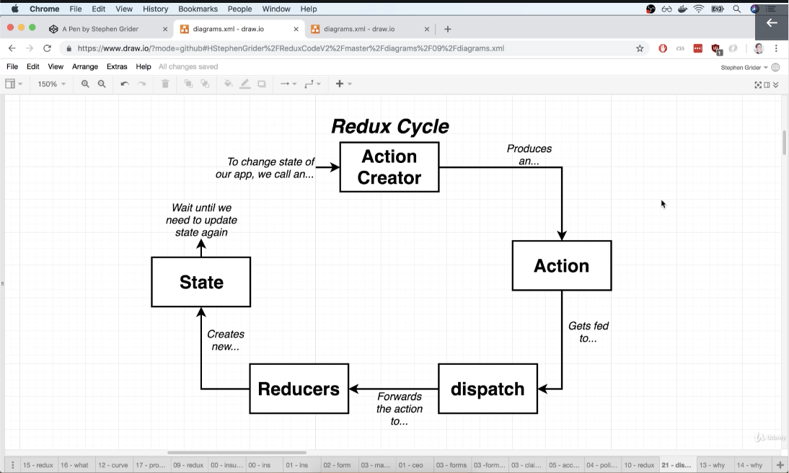
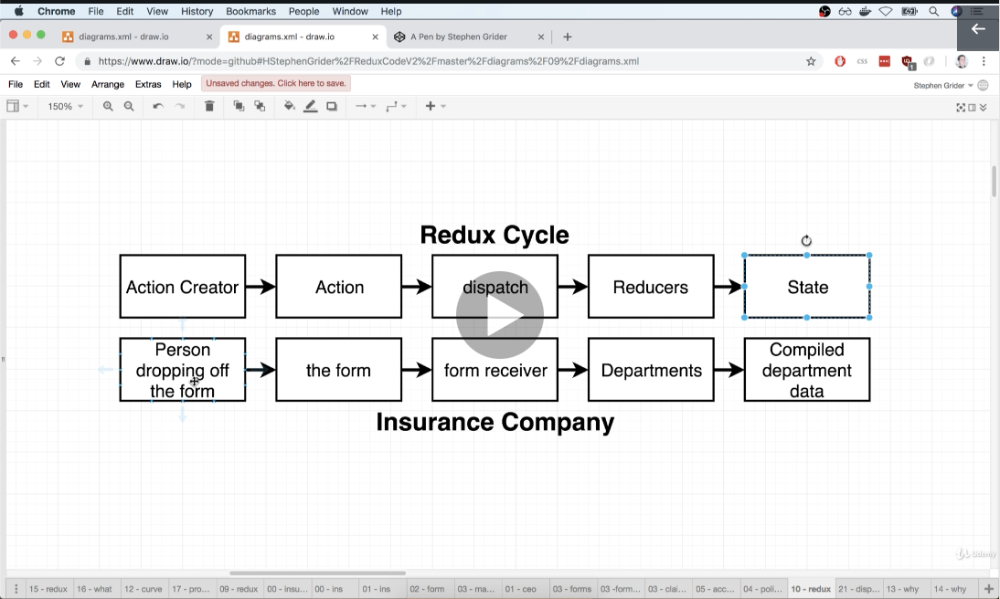

# A typical callback function (get geolocation):

```js
const App = () => {
    // The function `getCurrentPosition`: https://developer.mozilla.org/en-US/docs/Web/API/Geolocation/getCurrentPosition
    // a successfull call stores the geolocation within `position`. error stores within `err`
    // NOTE: we're actually PASSING a callback function into `getCurrentPosition`. `getCurrentPosition` doesn't store
    // the result on its own
    window.navigator.geolocation.getCurrentPosition(
        position => console.log(position),
        err => console.log(err)
    );

    return <div>Hi There!</div>;
};
```

# Classes and State

-   State can only be used with class components (mostly)
-   State is NOT the same as props
-   The key to re-render a component; we must update its state
-   State must be initialised when a component is created
-   State can **only** be updated using the function `setState`, e.g:
    `this.setState({ lat: position.coords.latitute })`

    -   The ONLY time `state` can be directly references is during initialisation:
        `this.state = { lat: null }`

```js
import React from "react";
import ReactDOM from "react-dom";

class App extends React.Component {
    constructor(props) {
        super(props);

        this.state = { lat: null, lon: null };

        window.navigator.geolocation.getCurrentPosition(
            position => {
                this.setState({
                    lat: position.coords.latitude,
                    lon: position.coords.longitude
                });
            },
            err => console.log(err)
        );
    }

    render() {
        return (
            <div>
                Latitude: {this.state.lat}
                <br></br>
                Longitude: {this.state.lon}
            </div>
        );
    }
}

ReactDOM.render(<App />, document.querySelector("#root"));
```

# Component Lifecycle Methods:

-   Sequence:
    constructor -> render -> componentDidMount -> componentDidUpdate -> componentWillUnmount

-   constructor: called during component initialisation
    -> used for one-time setup stuff
    -> by convention, do any data-loading within componentDidMount and not here for centralised data-loading
-   render: called whenver state is updated (i.e. through `setState`)
    -> avoid doing anything besides returning JSX
-   componentDidMount: called immediately after content is visible on screen
    -> good place to do data loading
-   componentDidUpdate: waits to be called **after** and update (i.e. **after** render as been called)
    -> good place to do more data-loading when state/props change
-   componentWillUnmount: called when component is no longer shown
    -> good place to do cleanup (especially for non-React stuff)

# Event Handlers:

-   The following two provide the exact same functionality:

## SYNTAX 1:

```js
import React from "react";

class SearchBar extends React.Component {
    onInputChange(event) {
        console.log(event.target.value);
    }

    render() {
        return (
            <div className="ui segment">
                <form className="ui form">
                    <div className="field">
                        <label>Image Search</label>
                        <input type="text" onChange={this.onInputChange} />
                    </div>
                </form>
            </div>
        );
    }
}

export default SearchBar;
```

## SYNTAX 2:

```js
import React from "react";

class SearchBar extends React.Component {
    render() {
        return (
            <div className="ui segment">
                <form className="ui form">
                    <div className="field">
                        <label>Image Search</label>
                        <input type="text" onChange={event => console.log(event.target.value)} />
                    </div>
                </form>
            </div>
        );
    }
}

export default SearchBar;
```

## Controlled vs Uncontrolled Elements

-   A react app can be split into 'React' side and 'HTML' side
-   A user interacts with the HTML side, and react attempts to re-render etc.

-   controlled element: ensuring 'React' side knows about the data within HTML side, i.e. ensuring user-input is stored within **state**
-   uncontrolled element: data only exists within HTML DOM

## A Controlled element for user input, controlling user data through state:

```js
import React from "react";

class SearchBar extends React.Component {
    state = { term: "" };

    render() {
        return (
            <div className="ui segment">
                <form className="ui form">
                    <div className="field">
                        <label>Image Search</label>
                        <input
                            type="text"
                            // NOTE: we're setting 'input' element to the value it already is. Seems confusing but is just
                            // React convention
                            value={this.state.term}
                            onChange={e => this.setState({ term: e.target.value })}
                        />
                    </div>
                </form>
            </div>
        );
    }
}

export default SearchBar;
```

# Binding and 'this' keyword:

-   when using `this`, e.g. `this.state.myInput`, if this is not correctly binded to the class object, it would lead to 'TypeError: Cannot read property 'state' of undefined', since `this` may refer to `undefined`
-   There are a few methods to ensure we explicitly bind the element

## METHOD 1

```js
import React from "react";

class SearchBar extends React.Component {
    state = { term: "input something..." };

    // DOES THE BINDING
    constructor() {
        super();
        this.onFormSubmit = this.onFormSubmit.bind(this);
    }

    onFormSubmit(event) {
        event.preventDefault(); // Disables form's default auto-submit when enter is pressed
        console.log(this.state.term);
    }

    render() {
        return (
            <div className="ui segment">
                <form onSubmit={this.onFormSubmit} className="ui form">
                    <div className="field">
                        <label>Image Search</label>
                        <input
                            type="text"
                            value={this.state.term}
                            onChange={e => this.setState({ term: e.target.value })}
                        />
                    </div>
                </form>
            </div>
        );
    }
}

export default SearchBar;
```

## METHOD 2

```js
import React from "react";

class SearchBar extends React.Component {
    state = { term: "input something..." };

    // DOES THE BINDING
    onFormSubmit = event => {
        event.preventDefault(); // Disables form's default auto-submit when enter is pressed
        console.log(this.state.term);
    };

    render() {
        return (
            <div className="ui segment">
                <form onSubmit={this.onFormSubmit} className="ui form">
                    <div className="field">
                        <label>Image Search</label>
                        <input
                            type="text"
                            value={this.state.term}
                            onChange={e => this.setState({ term: e.target.value })}
                        />
                    </div>
                </form>
            </div>
        );
    }
}

export default SearchBar;
```

## METHOD 3

```js
import React from "react";

class SearchBar extends React.Component {
    state = { term: "input something..." };

    onFormSubmit(event) {
        event.preventDefault(); // Disables form's default auto-submit when enter is pressed
        console.log(this.state.term);
    }

    render() {
        return (
            <div className="ui segment">
                {/* DOES THE BINDING */}
                <form onSubmit={event => this.onFormSubmit(event)} className="ui form">
                    <div className="field">
                        <label>Image Search</label>
                        <input
                            type="text"
                            value={this.state.term}
                            onChange={e => this.setState({ term: e.target.value })}
                        />
                    </div>
                </form>
            </div>
        );
    }
}

export default SearchBar;
```

### BIND FIX EXAMPLE (with an async function):

```js
import React from "react";
import axios from "axios";
import SearchBar from "./SearchBar";

class App extends React.Component {
    state = { images: [] };

    onSearchSubmit = async term => {
        //  WAS PREVIOUSLY: `async onSearchSubmit(term) {`
        const response = await axios.get("https://api.unsplash.com/search/photos", {
            params: { query: term },
            headers: {
                Authorization: "Client-ID 8f963700517eb3bed42120eef3cb86dbe68052ea1f6cb81797e1a4761195e9cb"
            }
        });

        // Since onSearchSubmit is actually being called in another class (since it's passed as a prop within SearchBar),
        // `this` in `this.setState` refers to the SearchBar class. This line will therefore cause an error if not bound
        this.setState({ images: response.data.results });
    };

    render() {
        return (
            <div className="ui container" style={{ marginTop: "10px" }}>
                <SearchBar onSubmit={this.onSearchSubmit} />
                Found: {this.state.images.length} images
            </div>
        );
    }
}

export default App;
```

##### This binding issue can equally be solved using the legacy method (METHOD 1):

```js
import React from "react";
import axios from "axios";
import SearchBar from "./SearchBar";

class App extends React.Component {
    state = { images: [] };

    constructor() {
        super();
        this.onSearchSubmit = this.onSearchSubmit.bind(this);
    }

    async onSearchSubmit(term) {
        const response = await axios.get("https://api.unsplash.com/search/photos", {
            params: { query: term },
            headers: {
                Authorization: "Client-ID 8f963700517eb3bed42120eef3cb86dbe68052ea1f6cb81797e1a4761195e9cb"
            }
        });

        this.setState({ images: response.data.results });
    }

    render() {
        return (
            <div className="ui container" style={{ marginTop: "10px" }}>
                <SearchBar onSubmit={this.onSearchSubmit} />
                Found: {this.state.images.length} images
            </div>
        );
    }
}

export default App;
```

# API Calls

-   Can use `fetch` or `axios` to make calls, however `axios` is preferred

-   To install axios for a project: `npm install --save axios`

*   When a request is sent with Axios, it works asynchronously so the request can be generated in the background
    Once ready, axios returns a `promise` containing the response. There are 2 ways to get this `promise`:

## METHOD 1:

```js
import React from "react";
import axios from "axios";
import SearchBar from "./SearchBar";

class App extends React.Component {
    onSearchSubmit(term) {
        axios
            .get("https://api.unsplash.com/search/photos", {
                params: { query: term },
                headers: {
                    Authorization: "Client-ID 8f963700517eb3bed42120eef3cb86dbe68052ea1f6cb81797e1a4761195e9cb"
                }
            })
            .then(response => {
                console.log(response.data.results);
            });
    }

    render() {
        return (
            <div className="ui container" style={{ marginTop: "10px" }}>
                <SearchBar onSubmit={this.onSearchSubmit} />
            </div>
        );
    }
}

export default App;
import React from "react";
import axios from "axios";
import SearchBar from "./SearchBar";

class App extends React.Component {
    onSearchSubmit(term) {
        axios
            .get("https://api.unsplash.com/search/photos", {
                params: { query: term },
                headers: {
                    Authorization: "Client-ID 8f963700517eb3bed42120eef3cb86dbe68052ea1f6cb81797e1a4761195e9cb"
                }
            })
            .then(response => {
                console.log(response.data.results);
            });
    }

    render() {
        return (
            <div className="ui container" style={{ marginTop: "10px" }}>
                <SearchBar onSubmit={this.onSearchSubmit} />
            </div>
        );
    }
}

export default App;
```

## METHOD 2:

```js
import React from "react";
import axios from "axios";
import SearchBar from "./SearchBar";

class App extends React.Component {
    async onSearchSubmit(term) {
        const response = await axios.get("https://api.unsplash.com/search/photos", {
            params: { query: term },
            headers: {
                Authorization: "Client-ID 8f963700517eb3bed42120eef3cb86dbe68052ea1f6cb81797e1a4761195e9cb"
            }
        });

        console.log(response.data.results);
    }

    render() {
        return (
            <div className="ui container" style={{ marginTop: "10px" }}>
                <SearchBar onSubmit={this.onSearchSubmit} />
            </div>
        );
    }
}

export default App;
```

# MAP statements:

```js
const numbers = [0, 1, 2, 3, 4];
let newNumbers = [];

/* METHOD 1: for loops which is what maps do interanlly: */
for (let i = 0; i < numbers.length; i++) {
    newNumbers.push(numbers[i] * 10);
}

/* METHOD 2: long-form map function */
numbers.map(num => {
    return num * 10;
});

/* METHOD 3: short-hand map function */
numbers.map(num => num * 10);
```

# Keys for props in lists

-   React provides better performance if keys are attributed to elements in a list that would be rendered to the DOM.
-   e.g. rendering a List object containing 10  elements would perform better if each  was given a unique ID.
-   An ID only needs to be assigned to the **root** element of the list. e.g. if each element in the list was an  wrapped in a <div>, we'd only assign an ID to the <div> since it's the root of the element

-   e.g:

```js
const images = props.images.map(image => {
    return (
        <div key={image.id}>
            
        </div>
    );
});
```

# Destructuring JSON objects when using map:

```js
const images = props.images.map(image => {
    return ;
});
```

<!-- DESTRUCTURE `image` into only the properties we want to use -->

```js
const images = props.images.map(({ description, id, urls }) => {
    return ;
});
return <div>{images}</div>;
```

# React Ref system

-   React's 'Ref' system replaces Javascript's `document.queryselector`
-   It's a way to access the HTML DOM, but does it in a React-y way (doesn't actually access HTML DOM?)
-   E.g. creating a Ref for an image allows us to access the image's properties when it's rendered on the HTML DOM

```js
import React from "react";

class ImageCard extends React.Component {
    constructor(props) {
        super(props);
        this.imageRef = React.createRef();
    }

    componentDidMount() {
        console.log(this.imageRef);
    }

    render() {
        const { description, urls } = this.props.image;
        return (
            <div>
                
            </div>
        );
    }
}

export default ImageCard;
```

---

# REDUX

## Redux Cycle:

- Action Creator:
    - A function that creates or returns a plain JS object (i.e. its only purpose is to create the Action)

- Action:
    - The plain JS object
    - Has a `Type` and `Payload` property
    - describes some **change** we want to make to the data of our app

- dispatch:
    - takes an action, makes copies of it, then passes it to a number of places in the app

- Reducers:
    - Is a function which takes in an `Action` and the existing data
    - It looks at the Action's type to decide how it will update the existing data

- State:
    - is the central repository of information within the app



## Example Redux Application:

```js
// People dropping off a form (Action Creator)
const createPolicy = (name, amount) => {
  return { // Aaction (a form)
    type: "CREATE_POLICY",
    payload: {
      name: name,
      amount: amount
    }
  };
};

const deletePolicy = (name)  => {
  return {
    type: "DELETE_POLICY",
    payload: {
      name: name
    }
  };
};

const createClaim = (name, amountOfMoneyToCollect) => {
  return {
    type: "CREATE_CLAIM",
    payload: {
      name: name,
      amountOfMoneyToCollect: amountOfMoneyToCollect
    }
  };
};


// Reducers (Departments!)
const claimsHistory = (oldListOfClaims = [], action) => {
  if (action.type === "CREATE_CLAIM"){
    // SYNTAX NOTE: creates a NEW array containing `oldListOfClaims` and `action.payload`
    return [...oldListOfClaims,  action.payload];
  }
    return oldListOfClaims;
};

const accounting = (bagOfMoney = 100, action) => {
  if (action.type === "CREATE_CLAIM"){
    return bagOfMoney - action.payload.amountOfMoneyToCollect;
  }
  else if (action.type === "CREATE_POLICY"){
    return bagOfMoney + action.payload.amount;
  }
  return bagOfMoney;

};

const policies = (oldListOfPolicies = [], action) => {
  if (action.type === "CREATE_POLICY"){
    return [...oldListOfPolicies, action.payload.name];
  }
  else if (action.type === "DELETE_POLICY"){
    return oldListOfPolicies.filter(policy => policy !== action.payload.name);
  }
  return oldListOfPolicies;
} ;

const { createStore, combineReducers } = Redux;

const ourDepartments = combineReducers({
  accounting: accounting,
  claimsHistory: claimsHistory,
  policies: policies
});

const store = createStore(ourDepartments);

store.dispatch(createPolicy("Alex", 20));
store.dispatch(createPolicy("Jim", 30));
store.dispatch(createPolicy("Bob", 40));

store.dispatch(createClaim("Alex", 100));
store.dispatch(createClaim("Jim", 50));

store.dispatch(deletePolicy("Bob"))

console.log(store.getState());
```

## Imports and Named Exports
- usually a component can be exported from a file using `export default selectSong`
  these are then import using: `import selectSong from '../actions/SelectSong.js'`
- To export multiple components from the same file, we can used Named exports:
```js
export const selectSong = song => {
    return {
        type: "SONG_SELECTED",
        payload: song
    };
};
```
```js
import { selectSong } from  '../actions/SelectSong';
```

## Webpack and index.js
- Any file called `index.js` within a directory is automatically imported. e.g. the example above:

/src/actions/index.js
```js
export const selectSong = song => {
    return {
        type: "SONG_SELECTED",
        payload: song
    };
};
```
/src/index.js
```js
// selectSong is already imported and can be used
```